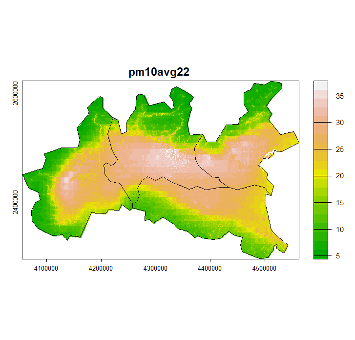

# Dataset Description: European Air Quality Data – Northern Italy (Lombardy, Emilia-Romagna, Piedmont, Veneto)

## Overview

This dataset contains **air quality indicator data** for selected Northern Italian regions—**Lombardy, Emilia-Romagna, Piedmont, and Veneto**—derived from the **European Air Quality Interpolated Data** provided by the **European Environment Agency (EEA)**. The data include pollutant concentrations interpolated over a grid using a *regression-interpolation-merging* approach. Observations from ground monitoring stations were used to generate yearly metrics across human health and vegetation impact indicators.

- 📅 **Published**: Not available  
- 🛠 **Last Modified**: 05 April 2025  
- 🔗 **Original Source**: [EEA Datahub Item](https://www.eea.europa.eu/en/datahub/datahubitem-view/82700fbd-2953-467b-be0a-78a520c3a7ef)

## Indicators – Human Health

| Pollutant | Type / Metric                                           | Regions Covered                        |
|-----------|----------------------------------------------------------|----------------------------------------|
| `PM10`    | Annual average, 90.4th percentile of daily means         | All regions                            |
| `PM2.5`   | Annual average                                           | All regions                            |
| `O₃`      | 93.2 percentile of max daily 8-hour means                | Lombardy, Piedmont, Emilia-Romagna     |
| `O₃`      | SOMO35, SOMO10                                           | Lombardy, Piedmont, Emilia-Romagna     |
| `NO₂`     | Annual average                                           | Lombardy, Piedmont, Emilia-Romagna     |

## Indicators – Vegetation Impact

| Metric                     | Description                                 | Regions Covered                    |
|----------------------------|---------------------------------------------|------------------------------------|
| `AOT40`                    | Accumulated Ozone exposure for vegetation   | All regions                        |
| `POD_WHEAT`, `POD_TOMATO`, `POD_POTATO` | Phytotoxic Ozone Dose (POD) for crop-specific exposure | All regions |

## Other Metrics

| Pollutant | Type / Metric       | Regions Covered |
|-----------|----------------------|-----------------|
| `NOx`     | Annual average       | All regions     |

## File Structure

- **`/data`**  
  Contains air quality data in two formats:
  - **CSV**: Tabular format for statistical analysis
  - **GeoTIFF**: Spatial raster format for geospatial applications

- **`/scripts`**  
  - `preprocess_metadata.R`: R script for preprocessing and standardizing metadata. Must be run locally after downloading the dataset. Directory paths may require manual adjustment.

## Example: PM10 Plot



## Preprocessing Instructions

To clean and structure the metadata for further analysis, use the following command:

```bash
Rscript scripts/processing_EEA_data.R
```

## Notes

- This dataset supports both environmental monitoring and health impact research.
- Regional coverage varies by indicator—please refer to tables above for details.
