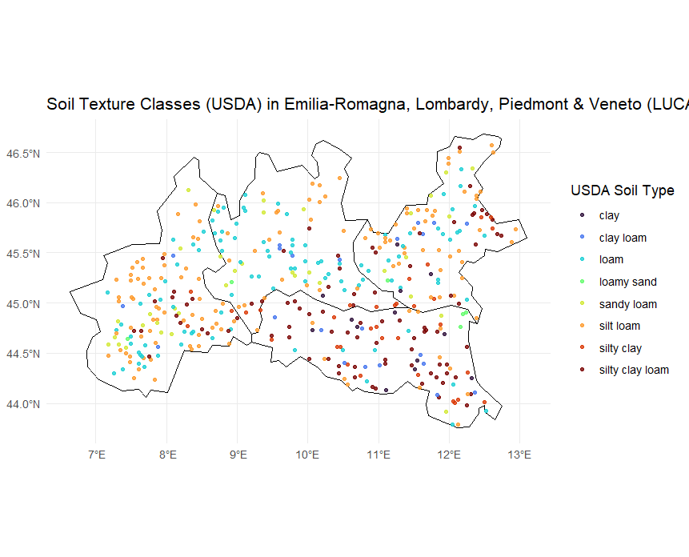

# LUCAS 2018 Soil Texture Data — Lombardy, Emilia-Romagna, Piedmont and Veneto

📅 **Date of Extraction**: 10 March 2025  
📂 **Source file**: `LUCAS_Text_All_10032025.shp`  
📍 **Regions included**: Lombardy (`ITC4`), Emilia-Romagna (`ITH5`), Piedmont (`ITC1`)  
📅 **Survey year**: 2018 only  
🧪 **Subset**: Points with available soil particle size distribution (PSD) data

---

## Description

This dataset is a filtered subset of the full LUCAS SOIL campaigns shapefile, including only:

- Points located in **Lombardy, Emilia-Romagna, Piedmont and Veneto**
- Points where a **soil sample was collected during the 2018 campaign**
- Points where **textural (particle size distribution)** data are available (i.e., clay, silt, sand)

Each point represents a LUCAS survey location with spatial coordinates and associated soil properties.

---

## Columns

| Column             | Description                                                                                       |
|--------------------|---------------------------------------------------------------------------------------------------|
| `POINTID`          | Unique LUCAS point identifier                                                                     |
| `NUTS_0`           | Country code (e.g. `"IT"` for Italy)                                                              |
| `Lucas2009`        | `1` if sampled in 2009, `0` otherwise                                                              |
| `Lucas2012`        | `1` if sampled in 2012, `0` otherwise                                                              |
| `Lucas2015`        | `1` if sampled in 2015, `0` otherwise                                                              |
| `Lucas2018`        | `1` if sampled in 2018, `0` otherwise                                                              |
| `Coarse`           | Coarse fragments in topsoil (% volume)                                                            |
| `Clay`             | Clay content (%)                                                                                  |
| `Sand`             | Sand content (%)                                                                                  |
| `Silt`             | Silt content (%)                                                                                  |
| `Available`        | `1` if PSD data is available (i.e., at least one valid texture measurement), `0` otherwise        |
| `From`             | Year of source survey for texture data (2009, 2012, 2015, or 2018)                                |
| `USDA`             | Soil texture class (USDA system), derived using the `soiltexture` Python library                  |
| `ISSS`             | Soil texture class (International classification system)                                          |
| `geometry`         | Point geometry (theoretical LUCAS coordinates)

---

## Notes

- The `Available` column corresponds to the Excel column **`PSDAvailable`**
- The `From` column indicates the **source campaign year** of the texture values
- The shapefile was derived from the Excel data in `LUCAS_Text_All_10032025.xlsx` and matched by `POINTID`
- Only 2018-sampled points with valid texture measurements were retained in this subset
- The texture classification columns were derived using the Python package [`soiltexture`](https://pypi.org/project/soiltexture/)

---

## Usage

This dataset is suitable for:

- Mapping soil texture across northern Italian regions
- Regional soil quality comparisons
- Environmental modeling and agronomic zoning

---
## Map of the data

## Citation

European Soil Data Centre (ESDAC). LUCAS Soil Database.  
URL: https://esdac.jrc.ec.europa.eu/

